# Messenger project

<details>
<summary>
English version
</summary>
<p></p>
<i>
World-it messenger - is a social network project where you can customize your account, create posts, albums, chat, and create group chats.

---
### Information
- [Installation and Setup](#installation-and-setup)
<!-- toc-disable -->
- [Project Participants](#project-participants)
<!-- toc-disable -->
- [Project and App Structure](#project-structure)
<!-- toc-disable -->
- [Technologies We Used](#technologies-we-used)
<!-- toc-disable -->
<!-- toc-disable -->
- [Responsibilities of Each App](#responsibilities-of-each-app)
<!-- toc-disable -->
- [Conclusion](#conclusion)
<!-- toc-disable -->
<!-- toc-disable -->
- [Project Development Prospects](#project-development-prospects)
<!-- toc-disable -->
---

## Figma Design Link  
https://www.figma.com/design/20TZphWNufeAQYOe7E1sze/%D0%A1%D0%BE%D1%86%D1%96%D0%B0%D0%BB%D1%8C%D0%BD%D0%B0-%D0%BC%D0%B5%D1%80%D0%B5%D0%B6%D0%B0-World-IT?node-id=6-26&t=6FcZEGOAfhm7mSQr-1jiX0W94etK-0

# Installation and Setup
*To install and run the project you will need:
- Python 3.8.10 or higher (check your version with `python --version`)
If it doesn't fit, you can restore it here<br>
https://www.python.org/downloads/
- Git 2.45.1 or higher (check your version with `git --version`)
If it doesn't fit, you can restore it here<br>
https://git-scm.com/downloads
## Steps
1. Get the repository link

    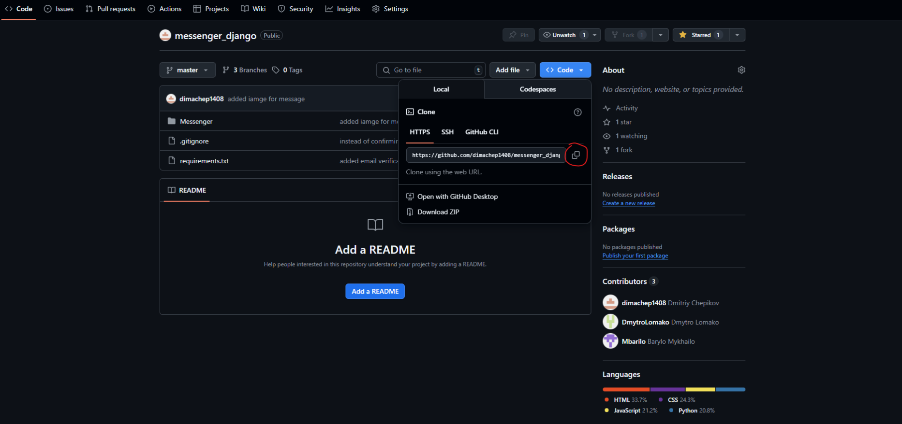

2. Clone the repository
```sh
git clone https://github.com/dimachep1408/messenger_django.git
``` 

3. Navigate to the project directory
```sh
cd messenger_django
```

<details>
<summary>
Windows
</summary>
<p></p>

4. Create a virtual environment
```sh
python -m venv venv
```

5. Activate the virtual environment
```sh
.venv\Scripts\activate
```

6. Install dependencies from `requirements.txt`
```sh
pip install -r requirements.txt
```

7. Detect project migrations
```sh
python manage.py makemigrations
```

8. Apply migrations
```sh
python manage.py migrate
```

9. Run the project
```sh
python manage.py runserver
```

</details>

<details>
<summary>
MacOS
</summary>
<p></p>

4. Create a virtual environment
```sh
python3 -m venv venv
```

5. Activate the virtual environment
```sh
source venv/bin/activate
```

6. Install dependencies from `requirements.txt`
```sh
pip3 install -r requirements.txt
```

7. Detect project migrations
```sh
python3 manage.py makemigrations
```

8. Apply migrations
```sh
python3 manage.py migrate
```

9. Run the project
```sh
python3 manage.py runserver
```
</details>
<p></p>

---

**Remote (on Railway):**
   - Log in to your account at [Railway](https://railway.com)
   - Click “Sign in”
        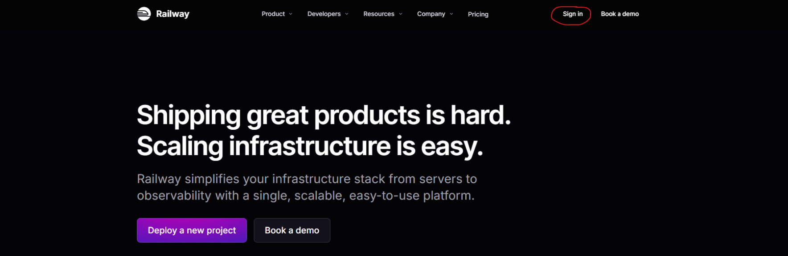
   - Click “Continue with GitHub”
        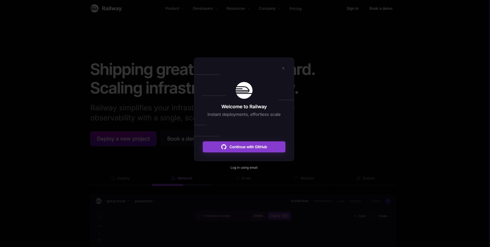

---

# Project Participants
1. [Dmytro Chepikov](https://github.com/dimachep1408) - team lead  
2. [Dmytro Lomako](https://github.com/DmytroLomako)  
3. [Misha Barylo](https://github.com/Mbarilo)  
4. [Feliks Denga](https://github.com/Feliks2010)

---

# Project Structure

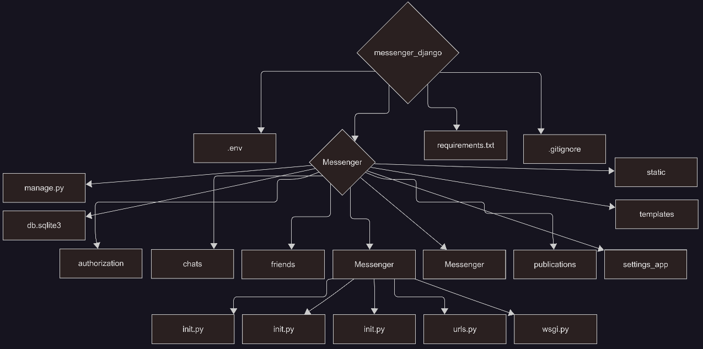

# App Structure

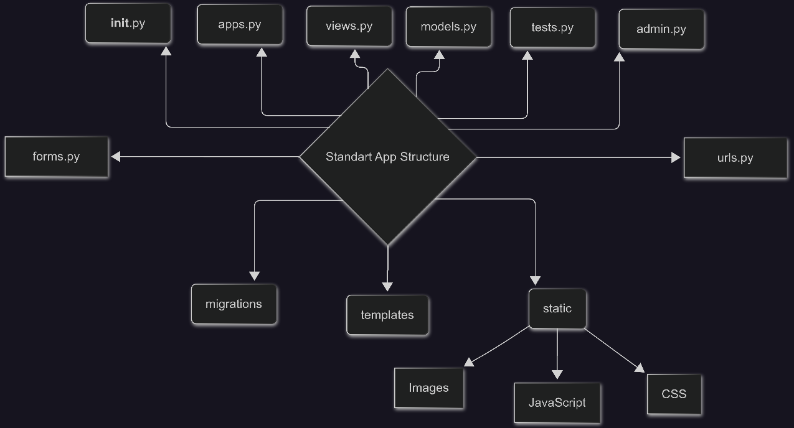

---

# Technologies We Used

* **Django** – Backend framework, request handling, and server-side WebSocket logic  
* **Pillow** – Image processing, saving avatars, post images, and message attachments  
* **os** – Filesystem management for saving images  
* **Daphne** – Required for async operations  
* **Channels** – Group and private chat handling  
* **WebSocket** – Sending and receiving messages on the server in real-time  

---

# Responsibilities of Each App

## `authorization`
### This app includes three subpages:
<b>• register</b> – <i>registration of users and adding them to the database  
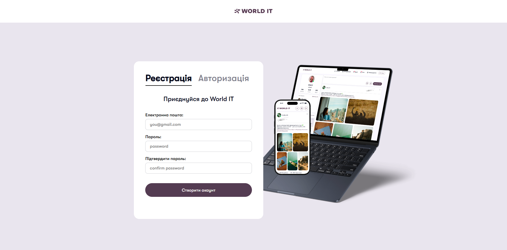

<b>• login</b> – <i>user login system linking the device to the account in the database  
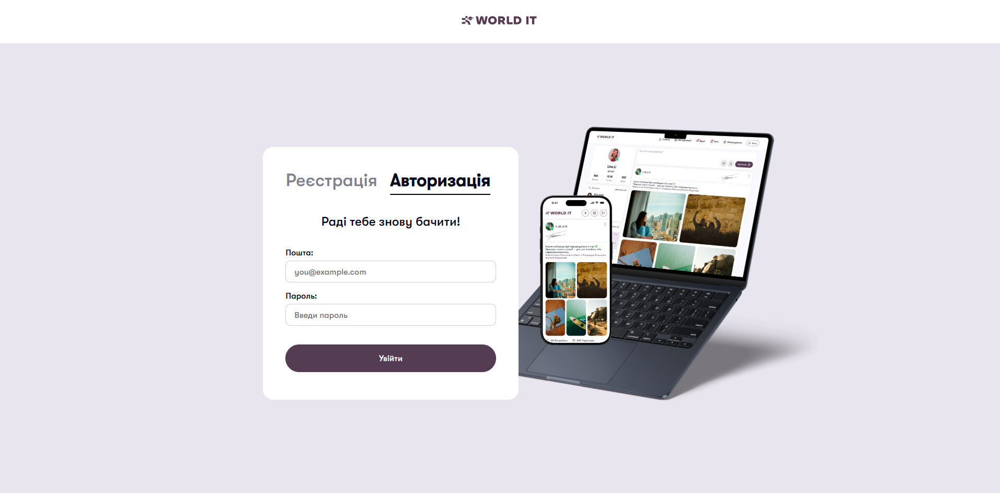

<b>• verification</b> – <i>email verification. A code is sent to the user’s email and must be entered to activate the account  
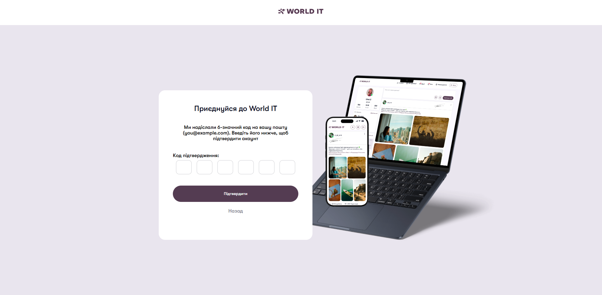

## `chats`
### This app includes two subpages:

<b>• chats</b> – <i>create group or personal chats and continue conversations  
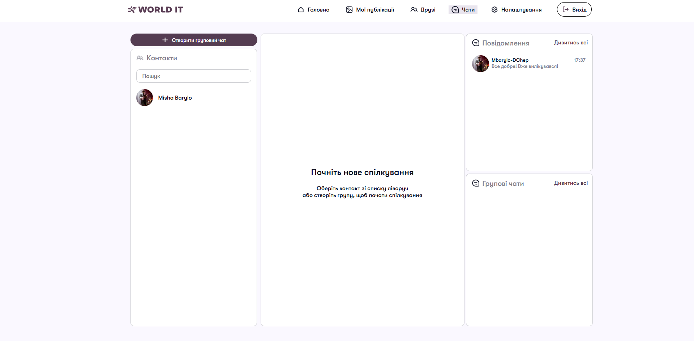

<b>• chat</b> – <i>real-time chatting with users, sending images, etc.  
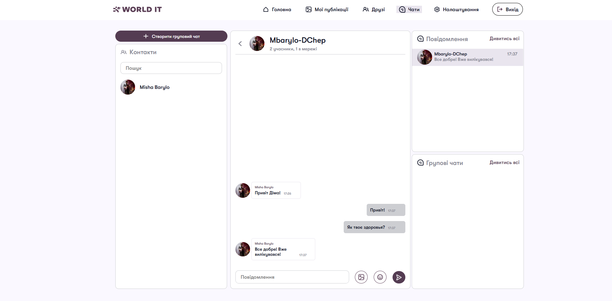

## `friends`
### This app has five subpages related to the main `friends.html` page:

<b>• friends</b> – General friends page showing requests, recommendations, and current friends  
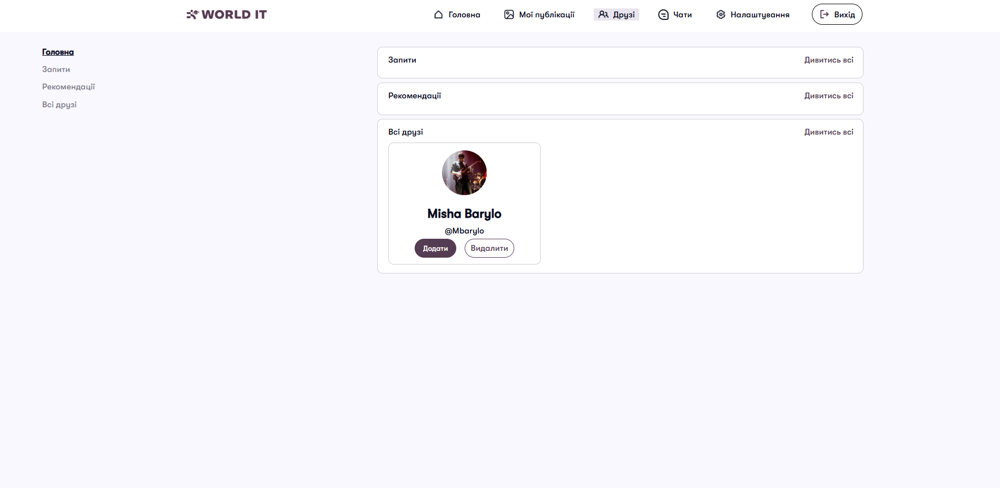

<b>• requests</b> – Shows only received friend requests  
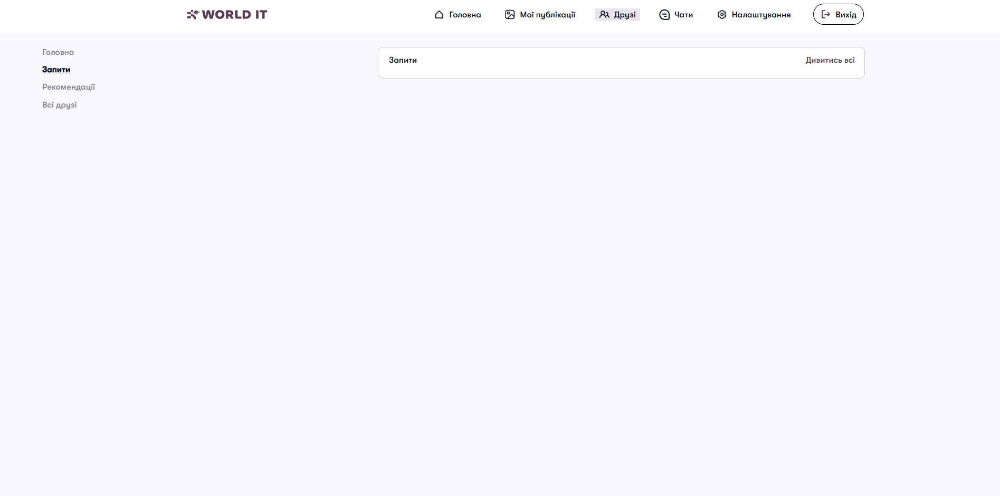

<b>• recommendations</b> – Shows users who can be added as friends  
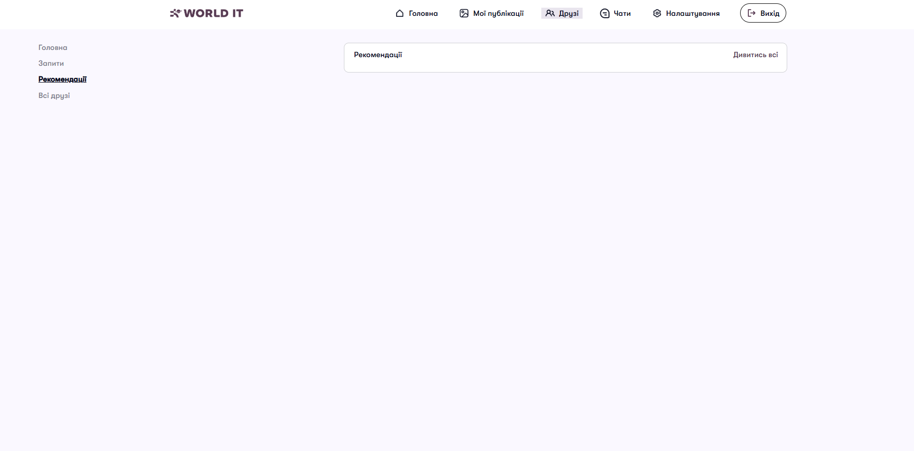

<b>• all-friends</b> – Shows accepted friend requests  
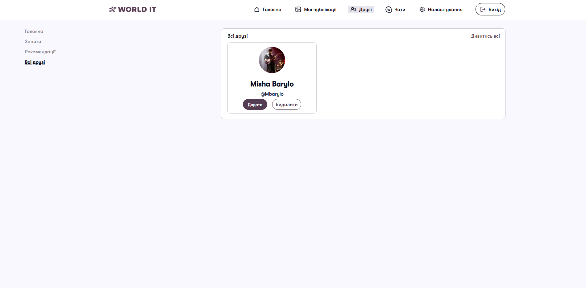

## `main`
<b>• main</b> – Main page showing all posts from all users (from newest to oldest), with post views, likes, ability to create posts, and view chats  
Post fields include:  
• Title  
• Tags  
• Text  
• Images  
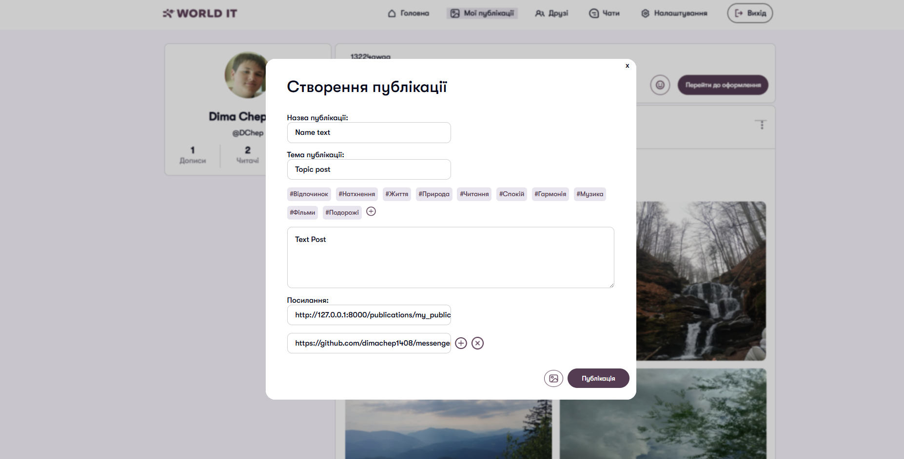

<hr>

## `publications`
<b>• publications</b> – Shows all user's posts (newest to oldest), with ability to edit or create new posts  
Post fields include:  
• Title  
• Tags  
• Text  
• Images  
  
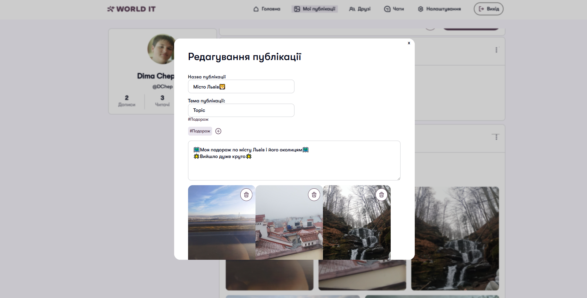

## `settings`
### This app has two subpages:

<b>• settings</b> – Settings page to update user info  
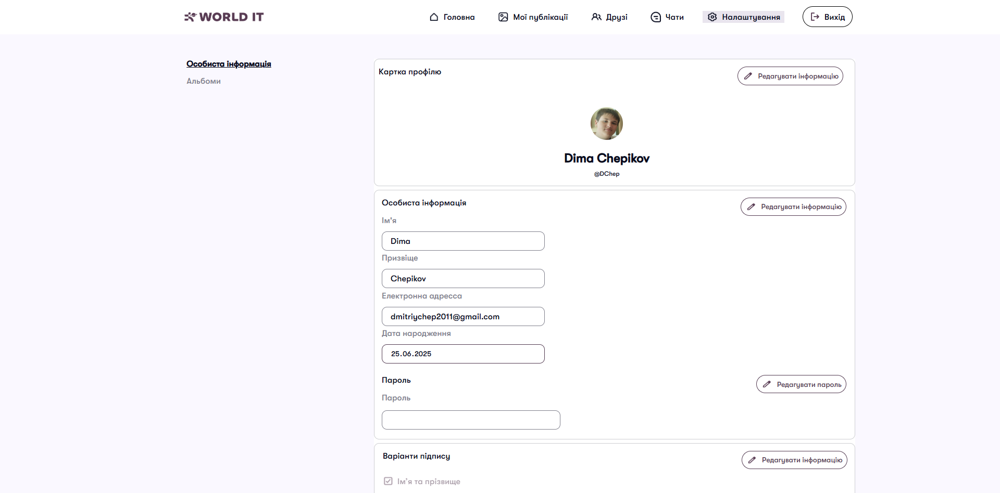

<b>• albums</b> – Page with user's albums containing photos from trips or moments  
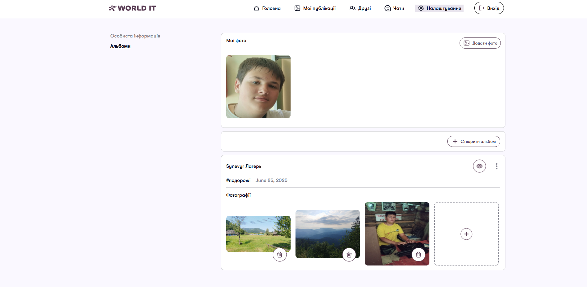  
Album fields:  
• Title  
• Theme  
• Year  
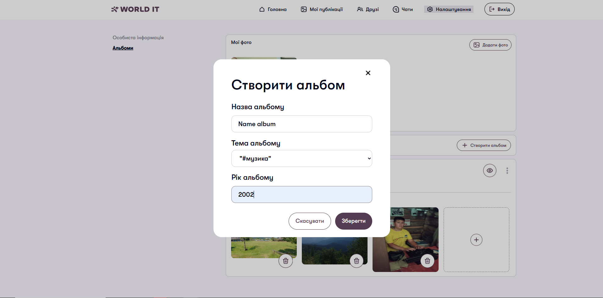

<hr>

# Unique Project Features

<b>• WebSocket</b> – Real-time messaging  
<b>• Ajax</b> – Send requests to server without reloading the page  
<b>• Channels</b> – Add users to a chat channel for real-time communication  
<b>• Pillow</b> – Image processing (avatars, post images, message images)  
<b>• Django tags</b> – Used to render server-side data on client (like posts, friends count, avatar, etc.)

# Conclusion
This messenger project helped us understand how to build a solid Django-based project (faster than Flask). We learned async communication in web apps, worked with complex DB structures, and got hands-on experience with WebSocket and Ajax.

The most difficult parts were configuring WebSocket & Channels, and implementing the friends system due to the many connections and logic. A lot of work was also done on the frontend – JavaScript, HTML, and CSS.

Overall, this was a great experience and a strong addition to our GitHub profiles!

# Project Development Prospects
- Add light/dark theme toggle  
- Allow multiple images per message  
- Add voice/video call functionality
---
</details>
<p></p>


World-it messenger - це проект соціальна мережа, в якому можна настраювати аккаунт, створювати пости, альбоми, переписуватись та створювати группові чати

---
### Інформація
- [Інсталяція та налаштування](#інсталяція-та-налаштування)
<!-- toc-disable -->
- [Учасники проекту](#учасники-проекту)
<!-- toc-disable -->
- [Структура проекту та додатків](#структура-проекту)
<!-- toc-disable -->
- [Технології які ми використовували](#технології-які-ми-використовували)
<!-- toc-disable -->
<!-- toc-disable -->
- [За що відповідає кожен додаток](#за-що-відповідає-кожен-додаток)
<!-- toc-disable -->
- [Висновок](#висновок)
<!-- toc-disable -->
<!-- toc-disable -->
- [Перспективи розвитку проекту](#перспективи-розвитку-проекту)
<!-- toc-disable -->
---

## Посилання на дизайн у Figma https://www.figma.com/design/20TZphWNufeAQYOe7E1sze/%D0%A1%D0%BE%D1%86%D1%96%D0%B0%D0%BB%D1%8C%D0%BD%D0%B0-%D0%BC%D0%B5%D1%80%D0%B5%D0%B6%D0%B0-World-IT?node-id=6-26&t=6FcZEGOAfhm7mSQr-1jiX0W94etK-0

# Інсталяція та налаштування
*Щоб інсталювати та спробувати запустити проект вам будуть потрібні встановлені:
- python 3.8.10 або вище (Перевірити вашу версію пайтону можна ввів команду в термінал <br>python --version)
Якщо не підходить то встановити можна тут<br>
https://www.python.org/downloads/
- git 2.45.1 або вище (Перевірити вашу версію гіту можна ввів команду в термінал git --version)
Якщо не підходить то встановити можна тут <br>
https://git-scm.com/downloads
## Алгоритм дій
1. Отримання посилання на репозиторій

    

2. Клонування репозиторію
```sh
git clone https://github.com/dimachep1408/messenger_django.git
``` 

3. Перехід до директорії проекту
```sh
cd messenger_django
```

<details>
<summary>
Windows
</summary>
<p></p>

4. Створення віртуального оточення
```sh
python -m venv venv
```

5. Активація віртуального оточення
```sh
.\venv\Scripts\activate
```

6. Встановлення залежностей з файлу requirements.txt
```sh
pip install -r requirements.txt
```

7. обнаруження міграцій проекту
```sh
python manage.py makemigrations
```

8. проведення міграцій проекту
```sh
python manage.py migrate
```

8. запуск проекту
```sh
python manage.py runserver
```

</details>

<details>
<summary>
MacOS
</summary>
<p></p>

4. Створення віртуального оточення
```sh
python3 -m venv venv
```

5. Активація віртуального оточення
```sh
source venv/bin/activate
```

6. Встановлення залежностей з файлу requirements.txt
```sh
pip3 install -r requirements.txt
```

7. обнаруження міграцій проекту
```sh
python3 manage.py makemigrations
```

8. проведення міграцій проекту
```sh
python3 manage.py migrate
```

8. запуск проекту
```sh
python3 manage.py runserver
```
</details>
<p></p>

---

**Віддалено (на Railway):**
   - Увійдіть у свій акаунт на [Railway](https://railway.com).
   - Нажміть на Sign in
        
   - Нажміть на continue with GitHub 
        
   -   

---

# Учасники проекту
1. [Dmytro Chepikov](https://github.com/dimachep1408) - team lead
2. [Dmytro Lomako](https://github.com/DmytroLomako)
3. [Misha Barylo](https://github.com/Mbarilo)
4. [Feliks Denga](https://github.com/Feliks2010)

---

# Структура проекту


# Структура додатків


---

# Технології, які ми використовували

* Django - фреймворк для бекенду, обробки запитів та серверної частини веб-сокету.
* Pillow – робота із зображеннями, збереження аватарів, картинок псотів та картинок для повідомлень.
* os – керування файловою системою, збереження зображень.
* Daphne - модуль для правильної роботи асинхронності
* Сhannels - додавання у группу та персональні чати
* WebSocket - віправка повідомлень та обработка на сервері
---
# За що відповідає кожен додаток
## authorization
### Цей додаток вносить в себе три вложені сторінки:
 <b>• register</b> - <i>реєстрація користувача щоб додати його у базу даних
    

 <b>• login</b> - <i>авторизація користувача у системі, щоб комп'ютер користвуача був прив'язан до користувача у БД(Базі Даних) 
    

 <b>• verification</b> - <i>підтвердження пошти користувача, на цій сторінці користувачу відправляєтся код на пошту та коли користвуач вводить цей код і він співпадає с кодом з пошти то користувач активуєтся
    

## chats
### Цей додаток вносить в себе дві вложені сторінки:

### також   
# Висновок
<b>• chats</b> - <i>Додаток у якому можна створити групповий чат, створити персональний чат, продовжити чатитись у вже свторенних чатах


<b>• chat</b> - <i>Додаток у якому можна переписуватись з другими користувачами у реальному часі(коли хтось відпраляє повідомлення) воно показуєтся у всіх хто є у цьому чаті. Також можна додавати картинку до повідомлень, весь функціонал сторінки всіх чатів зберігаєтся


## friends
### Цей додаток вносить в себе п'ять вложених сторінок тісно зв'язані із основною (friends.html)
<b>• friends</b> - Загальний додаток друзів, де відображаются запити інших користувачів рекомендації, де відображаются всі користувачи які не додані до друзів, якім не було відправлено запрос та не ті від яких очікуєтся запрос. Та всі друзі якім відрпавили запрос та вони цей запрос прийнали


<b>• requests</b> -  Відображення тільки запросів на дружбу які нам вислали


<b>• recomendations</b> -  Відображення тільки всіх користувачів


<b>• all-friends</b> -  Відображення тільки всіх друзів які прийняли наш відправлений запрос


## main
<b>• main </b> - ця сторінка є основною, тут показуются всі пости всіх користувачів(від найновіших до найстаріших), при їх просмотрі додаєтся просмотр для посту, Також тут відображаются всі чати які є у користувача та запроси для додавання до друзів. Також пости можна лайкнути та на цій сторінці можна створити пост, у поста є такі поля:<br>   
• Назва<br>• Тема<br>• Теги<br> • Текст Поста<br>• Посилання <br> • Картинки

<hr>

## publications
<b>• publications </b> - ця сторінка зберігає всі пости користвача(від найновіших до найстаріших), пости можна редагувати та також створювати нові на цій сторінці можна створити пост, у поста є такі поля:<br>   
• Назва<br>• Тема<br>• Теги<br> • Текст Поста<br>• Посилання <br> • Картинки


## settings
### Цей додаток вносить в себе дві вложені сторінки
<b>• settings </b> - це сторінка налашатувань на який можна налаштувати всю інформацію яку ви водили до цього


<b>• albums </b> - це сторінка з альбомами в якої будуть фото користувача та всі альбоми користувача які можуть буди наповнені фото з якоїсь подорожі чи моменту. 

Альбом хранить в собі такі поля:

• Назва<br>• тема альбому<br> • рік


<hr>

# Унікальні функції проекту
<b>• WebSocket </b> - У цьому проекту ми працювали із технологію WebSoket для відправки повідомлення  та його отримки
<b>• Ajax </b> - Також, ми працювали з ajax це бібліотека javascript за допомогої якої можно відправляти запрос на сервер без перезавантаження сторінки
<b>• Channels </b> - Це технологія за допомогої якої можна підключати користувачів у один канал для того щоб вони могли переписуватись
<b>• Pillow </b> - Очевидно, що у проекту месседжері потрібно працювати з зображеннями, ось для цього ми і підключали pillow у проект
<b>• Django tags </b> - Як задіяти дані які ми додали на частині сервера у клієнта? Джанго теги. З їх допомогою ми показували всі пости, кількість друзів, читачів та постів, аватарку, ім'я, призвище, юзернейм

# Висновок
   Проект messenger допоміг нам зрозуміти як створювати сильний проект на фреймворці django і наскільки його можна робити більш масштабним в усіх напрямках, ніж на flask, також ми зрозуміли як працювати з асинхронністью у web-додатках, також ми працювали з більш складною структурою бази даних. Це був дуже цікавий та складний проект для нас.
   В цьому проєкті ми задіяли дуже багато нових для нас технологій, ось кілька з них: Daphne, Сhannels, WebSocket
   
   Складніше за все для нас було настроїти WebSocket і Channels, щоб чати працювали в режимі реального часу, та дуже складно для нас було зробити додаток друзів, дуже багато зв'язків, та коду на стороні backend. Багато роботи із frontend стороною, з javascript, html та css.

Цей проект ми робили командою, ми дуже вдячні один одному за співпрацю та взаємодопомогу.
Так як ми працювали командою, ми удосконалили свої навички у роботі з гіт-хаб.
    
   Взагалом цей проект був для нас дуже крутим, цікавим і корисним досвідом, та додатком до нашого профілю гіт-хаб!

<b>Перспективи розвитку проекту</b
- Додати можливість переключення між білою та чорною темою
- Зробити так, щоб у повідомленнях можна було додавати багато картинок
- Додати функцію звонків


